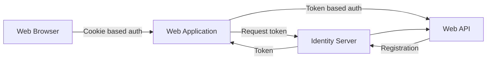

# ASP.NET authentication

ASP.NET authentication example.

```mermaid
flowchart LR
  browser[Web Browser]
  webapp[Web Application]
  api[Web API]
  identityServer[Identity Server]

  browser -- Cookie based auth --> webapp
  webapp -- Request token --> identityServer
  identityServer -- Token --> webapp
  webapp -- Token based auth --> api
  api -- Registration --> identityServer
  identityServer --> api
```